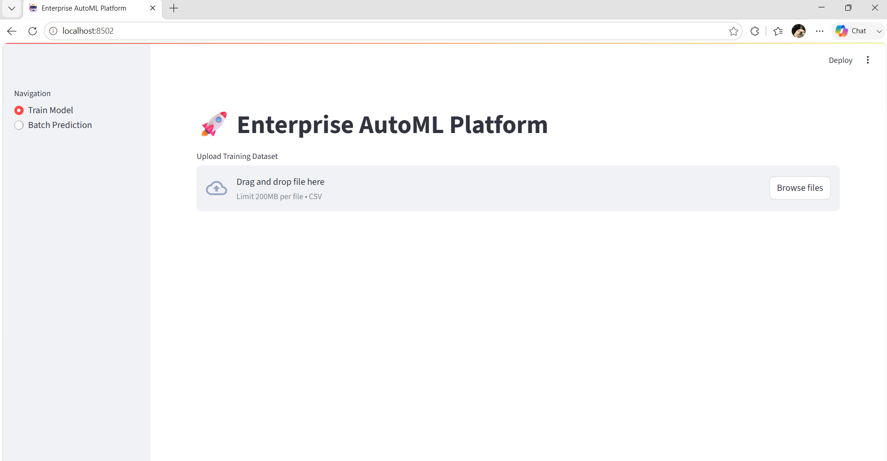
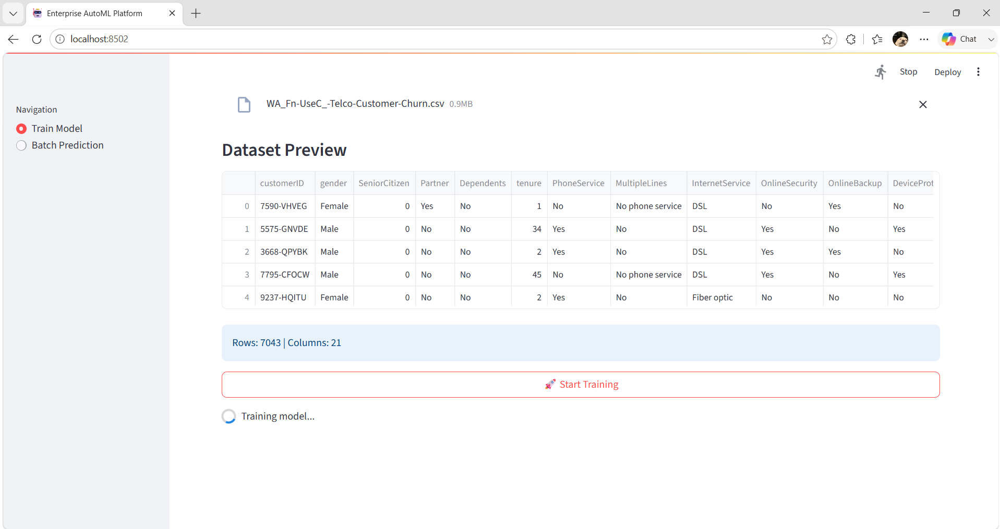
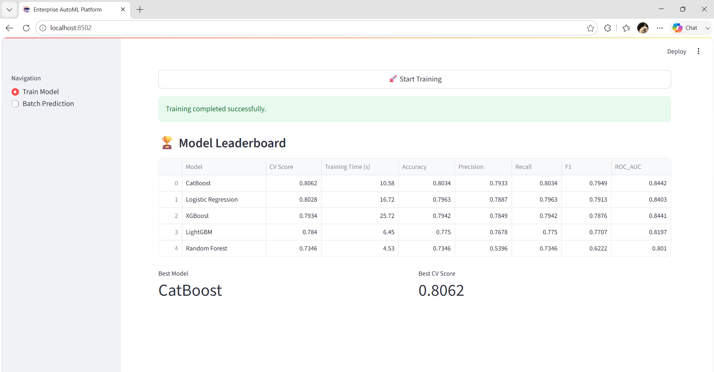
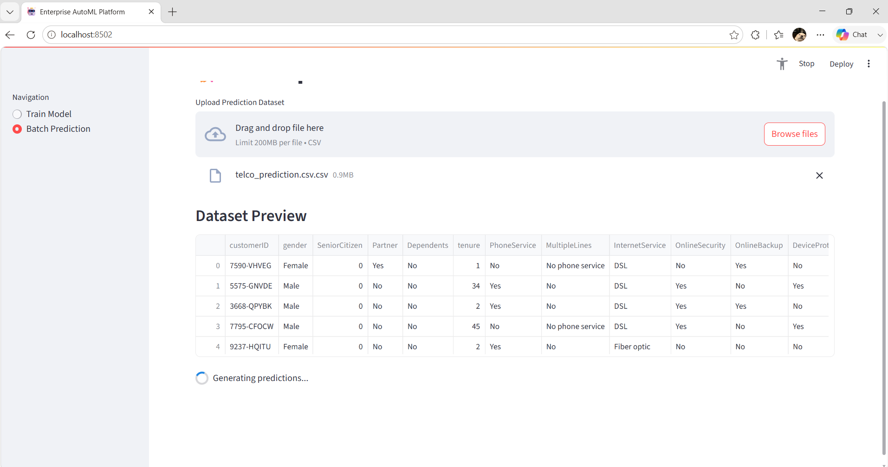
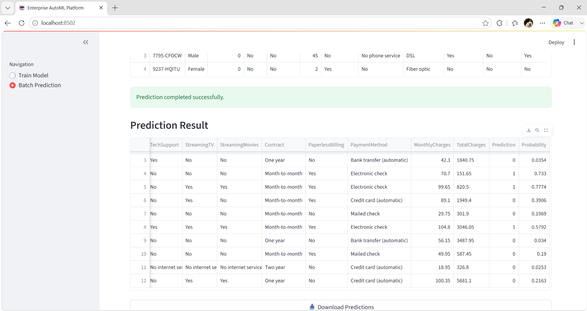
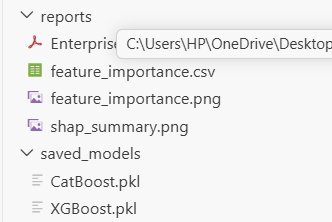

# 🚀 Enterprise AutoML Platform

<p align="center">


</p>

---

# 📌 Overview

Enterprise AutoML Platform is an enterprise-grade machine learning framework that automates the complete machine learning lifecycle—from data ingestion to model deployment.

The platform automatically detects whether the uploaded dataset belongs to a **Classification** or **Regression** problem and trains multiple machine learning models with hyperparameter optimization using Optuna.

After training, the system generates explainability reports using SHAP, evaluates models using multiple metrics, ranks them on a leaderboard, saves the best model, and provides batch prediction through a Streamlit dashboard and FastAPI.

The project follows a modular enterprise architecture, making it easy to maintain, extend, and deploy.

---

# 📑 Table of Contents

- Overview
- Features
- Architecture
- Project Structure
- Tech Stack
- Installation
- Usage
- Dashboard
- Reports
- Results
- API
- Roadmap
- Future Improvements
- Author
- License

---

## 🚀 Highlights

- Automatic Classification & Regression
- 5 ML Models + Optuna
- SHAP Explainability
- Batch Prediction
- FastAPI
- Streamlit
- Docker

# ✨ Features

## 📂 Data Pipeline

- CSV Upload
- Automatic Data Validation
- Schema Generation
- Missing Value Handling
- Feature Engineering
- Feature Scaling
- Feature Encoding
- Automatic Problem Detection
- SMOTE for Imbalanced Classification

---

## 🤖 AutoML

- Automatic Model Selection
- Hyperparameter Optimization using Optuna
- Cross Validation
- Model Comparison
- Leaderboard Generation
- Best Model Selection
- Classification Support
- Regression Support

---

## 📊 Explainability

- SHAP Explainability
- Feature Importance
- Feature Importance CSV
- SHAP Summary Plot
- PDF Report Generation

---

## 📈 MLOps

- MLflow Tracking
- Model Registry
- Model Versioning
- Batch Prediction
- Prediction Monitoring
- Data Drift Detection

---

## 🌐 Deployment

- Streamlit Dashboard
- FastAPI REST API
- Docker Support

---

# 🏗️ Enterprise Architecture

```text
                           CSV Dataset
                                │
                                ▼
                     Data Validation Layer
                                │
                                ▼
                     Automatic Schema Generation
                                │
                                ▼
                      Data Preprocessing Layer
          ┌─────────────────────────────────────────┐
          │ Missing Value Handling                  │
          │ Feature Encoding                        │
          │ Feature Scaling                         │
          │ Feature Engineering                     │
          └─────────────────────────────────────────┘
                                │
                                ▼
                     Automatic Problem Detection
                                │
               ┌────────────────┴────────────────┐
               │                                 │
               ▼                                 ▼
        Classification                     Regression
               │                                 │
               └───────────────┬─────────────────┘
                               ▼
                        Enterprise AutoML
                               │
      ┌─────────────────────────────────────────────────────┐
      │ Logistic Regression                                 │
      │ Random Forest                                       │
      │ XGBoost                                              │
      │ LightGBM                                             │
      │ CatBoost                                             │
      └─────────────────────────────────────────────────────┘
                               │
                               ▼
                  Optuna Hyperparameter Optimization
                               │
                               ▼
                      Cross Validation & Evaluation
                               │
                               ▼
                         Model Leaderboard
                               │
                               ▼
                        Best Model Selection
                               │
      ┌──────────────┬───────────────┬───────────────┐
      ▼              ▼               ▼
  MLflow       SHAP Explainability   PDF Report
                               │
                               ▼
                   Model Registry & Versioning
                               │
                               ▼
                       Batch Prediction Engine
                               │
                               ▼
                    Streamlit Dashboard / FastAPI
```

---

# 📁 Project Structure

```text
enterprise-automl-platform/
│
├── artifacts/
│   ├── data_ingestion/
│   ├── data_transformation/
│   ├── model_trainer/
│   └── prediction/
│
├── configs/
│   ├── config.yaml
│   ├── params.yaml
│   └── schema.yaml
│
├── data/
│
├── docs/
│
├── logs/
│
├── notebooks/
│
├── reports/
│
├── saved_models/
│
├── screenshots/
│
├── src/
│   │
│   ├── components/
│   ├── configuration/
│   ├── constants/
│   ├── entity/
│   ├── exception/
│   ├── logger/
│   ├── monitoring/
│   ├── pipeline/
│   ├── reports/
│   ├── utils/
│   └── visualization/
│
├── tests/
│
├── app.py
├── api.py
├── Dockerfile
├── docker-compose.yml
├── requirements.txt
├── README.md
└── setup.py
```

---

# ⚙️ Tech Stack

## Programming Language

- Python 3.11

---

## Machine Learning

- Scikit-Learn
- XGBoost
- LightGBM
- CatBoost
- Optuna
- SHAP

---

## Data Processing

- Pandas
- NumPy
- SciPy

---

## Visualization

- Matplotlib
- Plotly

---

## Backend

- FastAPI

---

## Dashboard

- Streamlit

---

## Experiment Tracking

- MLflow

---

## Monitoring

- Evidently AI

---

## Database

- MySQL
- PostgreSQL

---

## Deployment

- Docker
- Docker Compose

---
### 🏆 Best Model

- CatBoost
- CV Score: 0.8085
- Training Time: XX sec


# 🚀 Installation

## Clone Repository

```bash
git clone https://github.com/<your-username>/enterprise-automl-platform.git

cd enterprise-automl-platform
```

---

## Create Virtual Environment

```bash
python -m venv venv
```

### Windows

```bash
venv\Scripts\activate
```

### Linux / macOS

```bash
source venv/bin/activate
```

---

## Install Dependencies

```bash
pip install -r requirements.txt
```

---

## Run Streamlit Dashboard

```bash
streamlit run app.py
```

---

## Run FastAPI

```bash
uvicorn api:app --reload
```

---

# 💻 Usage

## Step 1 — Launch the Application

```bash
streamlit run app.py
```

---

## Step 2 — Train a Model

1. Open the Streamlit dashboard.
2. Navigate to **Train Model**.
3. Upload a CSV dataset.
4. Click **Start Training**.

The platform will automatically:

- Validate the dataset
- Detect the ML problem type
- Preprocess the data
- Train multiple models
- Perform Optuna hyperparameter optimization
- Compare model performance
- Select the best model
- Generate SHAP explainability
- Generate PDF reports
- Save the trained model

---

## Step 3 — Batch Prediction

1. Open **Batch Prediction**
2. Upload a dataset **without the target column**
3. Click **Predict**
4. Download the prediction CSV

---

# 📸 Screenshots

# 📸 Screenshots

## 🏠 Home Dashboard



---

## 🚀 Train Model



---

## 🏆 Training Completed


---

## 📊 Model Leaderboard



---

## 🔮 Batch Prediction



---

## 📈 Prediction Result



---

## 📄 Generated Reports




---

# 📊 Example Results

| Model | Cross Validation Score |
|--------|----------------------:|
| CatBoost | **0.8085** |
| XGBoost | 0.8055 |
| Logistic Regression | 0.8028 |
| LightGBM | 0.8019 |
| Random Forest | 0.7346 |

> Results may vary depending on the dataset.

---

# 📈 Generated Reports

The platform automatically generates:

- ✅ Model Leaderboard
- ✅ Feature Importance CSV
- ✅ SHAP Summary Plot
- ✅ SHAP Feature Importance Plot
- ✅ Enterprise PDF Report
- ✅ Prediction CSV
- ✅ Monitoring Logs

Reports are stored in:

```text
reports/
```

---

# 🌍 REST API

| Method | Endpoint | Description |
|---------|----------|-------------|
| GET | `/` | API Status |
| GET | `/health` | Health Check |
| GET | `/model-info` | Best Model Information |
| GET | `/monitoring` | Monitoring Summary |
| POST | `/predict` | Batch Prediction |

---

## Example Prediction Request

```json
{
  "gender": "Male",
  "tenure": 12,
  "MonthlyCharges": 70.5,
  "TotalCharges": 850.0
}
```

---

## Example Prediction Response

```json
{
  "prediction": 0,
  "probability": 0.92
}
```

---

# 🧪 Testing

Run all tests:

```bash
pytest
```

Run a specific test:

```bash
pytest tests/
```

---

# 📦 Docker

Build the image:

```bash
docker build -t enterprise-automl-platform .
```

Run the container:

```bash
docker run -p 8501:8501 enterprise-automl-platform
```

---

# 🛣️ Project Roadmap

## ✅ Completed

- [x] Enterprise Data Pipeline
- [x] Automatic Problem Detection
- [x] Feature Engineering
- [x] Automatic Preprocessing
- [x] AutoML Engine
- [x] Multi-Model Training
- [x] Hyperparameter Optimization (Optuna)
- [x] Cross Validation
- [x] Model Comparison
- [x] Automatic Best Model Selection
- [x] SHAP Explainability
- [x] Feature Importance Reports
- [x] PDF Report Generation
- [x] Batch Prediction
- [x] Streamlit Dashboard
- [x] FastAPI Integration
- [x] Model Registry
- [x] Model Versioning
- [x] Model Monitoring
- [x] Docker Support

---

# 🚀 Future Enhancements

- [ ] Cloud Deployment (AWS / Azure / GCP)
- [ ] CI/CD Pipeline using GitHub Actions
- [ ] Kubernetes Deployment
- [ ] Authentication & User Management
- [ ] Auto Retraining Pipeline
- [ ] Feature Store Integration
- [ ] Time Series AutoML
- [ ] Deep Learning Model Support
- [ ] Explainability Dashboard
- [ ] Drift Monitoring Dashboard
- [ ] Email Notifications
- [ ] Experiment Comparison Dashboard

---

# 🤝 Contributing

Contributions are welcome!

If you would like to improve this project:

1. Fork the repository
2. Create a new feature branch

```bash
git checkout -b feature/new-feature
```

3. Commit your changes

```bash
git commit -m "Add new feature"
```

4. Push your branch

```bash
git push origin feature/new-feature
```

5. Open a Pull Request

---

# 🙏 Acknowledgements

This project makes use of the following open-source libraries:

- Scikit-Learn
- Pandas
- NumPy
- XGBoost
- LightGBM
- CatBoost
- Optuna
- SHAP
- Streamlit
- FastAPI
- MLflow
- ReportLab
- Matplotlib
- Plotly

Special thanks to the open-source community for building these amazing tools.

---

# 👨‍💻 Author

## Hridhaan Singh Dhamani

**Data Analyst | Aspiring Data Scientist | Machine Learning Engineer**

🎓 M.Sc. Bioinformatics

📍 Nagpur, Maharashtra, India

### Connect with me

- GitHub: https://github.com/hridhaansinghdhamani
- LinkedIn: https://www.linkedin.com/in/hridhaansinghdhamani/

---

# 📄 License

This project is licensed under the **MIT License**.

You are free to use, modify, and distribute this project under the terms of the MIT License.

---

# ⭐ Support

If you found this project useful:

⭐ Star this repository

🍴 Fork the repository

🛠️ Contribute to the project

📢 Share it with others

---

<p align="center">

### 🚀 Enterprise AutoML Platform

**Automating the complete Machine Learning lifecycle with Explainable AI and MLOps**

Made with ❤️ using Python, Streamlit, FastAPI, Optuna, SHAP and Scikit-Learn.

</p>
